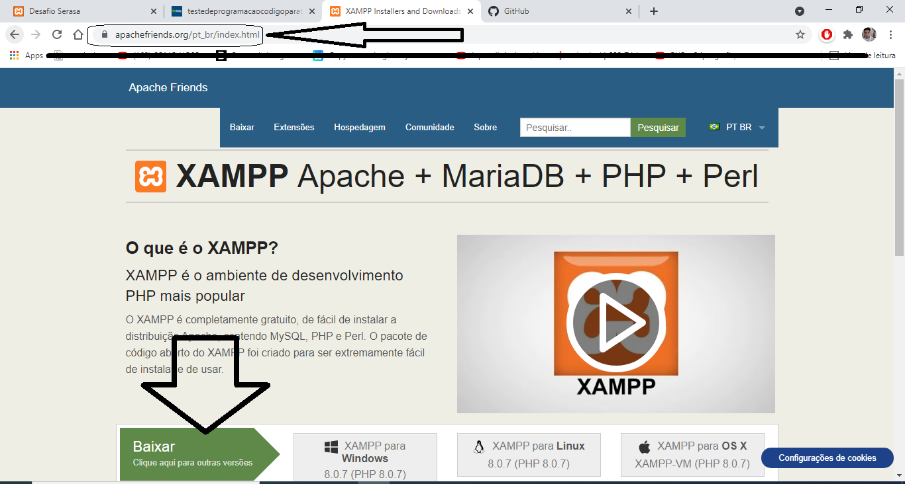
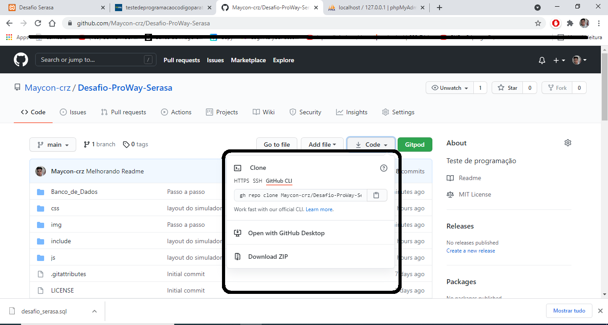
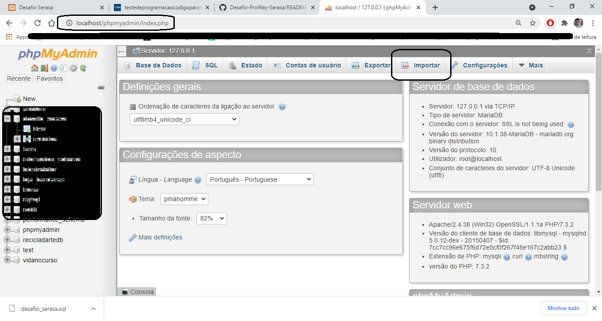
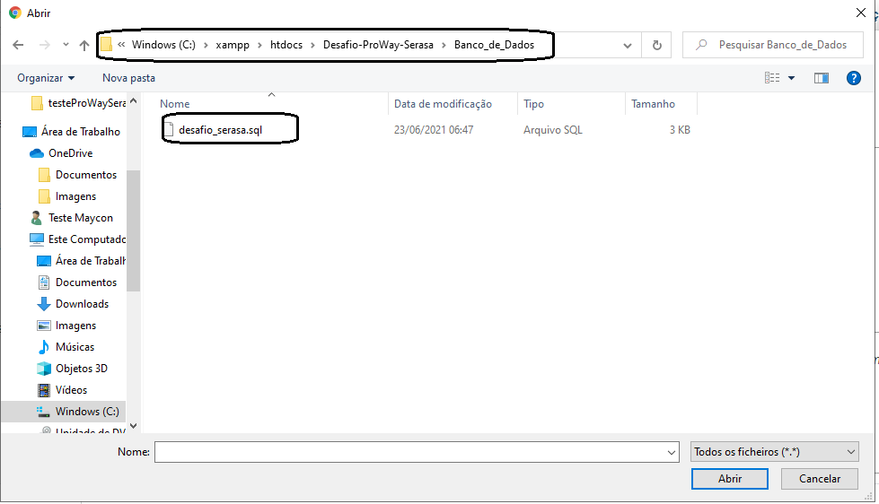
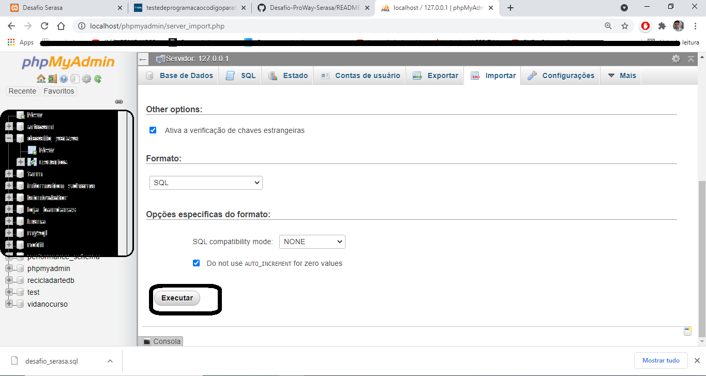
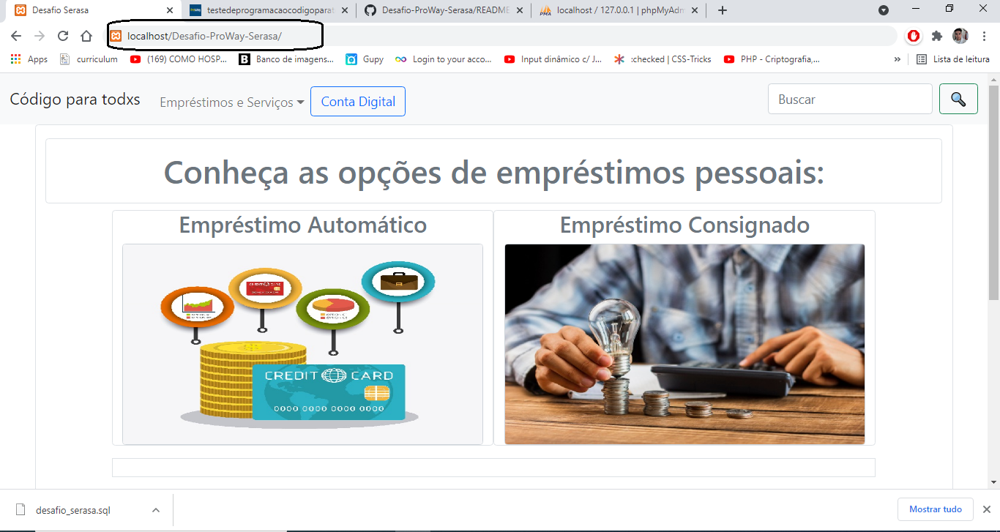

# Desafio-ProWay-Serasa
 Teste de programação

 Para Visualizar e Interagir com o Sistema siga os passos:

 <h3> 1) Baixar, instalar e iniciar o XAMPP que é o ambiente de desenvolvimento PHP mais popular;</h3>
 
 <h3> 2) Clone o repositório para a pasta htdocs do XAMPP ou baixe o zip e descompacte lá;</h3>
 
 <h3> 3) No navegador e acesse: http://localhost/phpmyadmin/index.php </h3>
 
 <h3> 4) Clique em importar -> Escolher ficheiro </h3>
 
 <h3> 5) Navegue até a pasta do banco de dados: C:\xampp\htdocs\Desafio-ProWay-Serasa\Banco_de_Dados</h3>
 
 <h3> 6) Selecione -> desafio_serasa.sql -> Clique no botão -> Executar;</h3>
 
 <h3> 7) Com o banco de dados Importado digite no navegador: http://localhost/Desafio-ProWay-Serasa/</h3>
 
